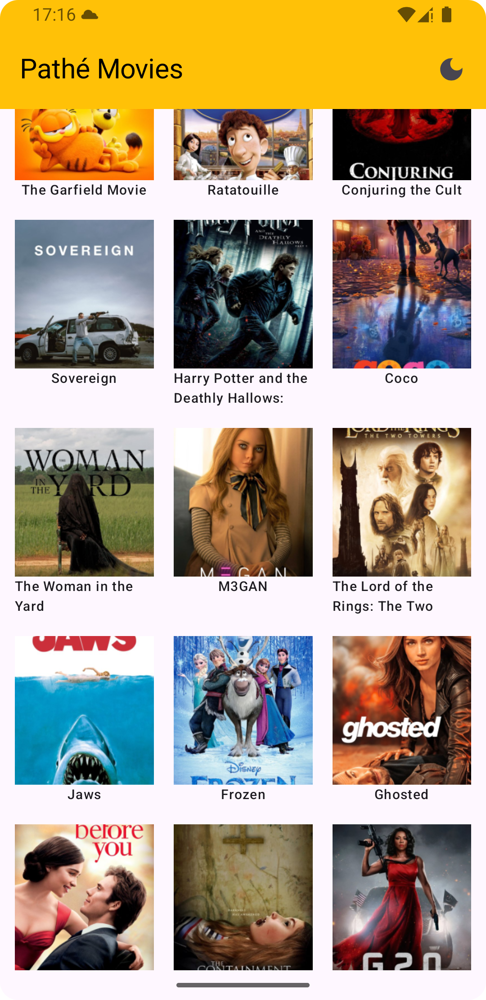
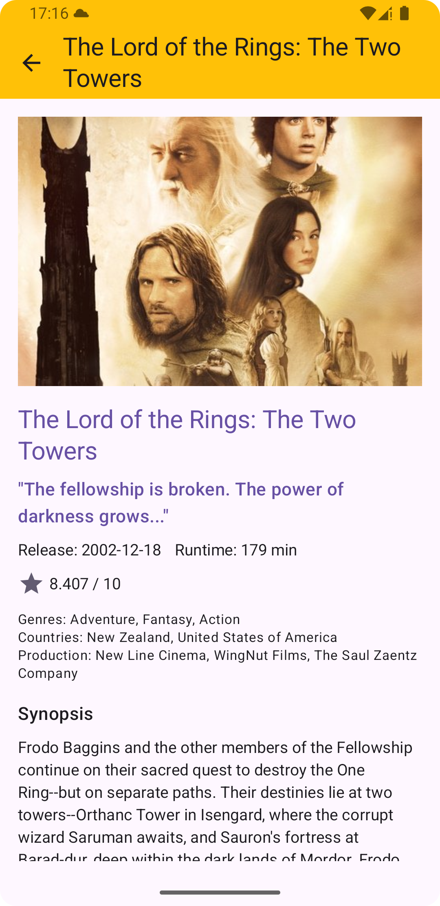

# 🎬 MovieListTMDB – Jetpack Compose Movie App
---
**MovieListTMDB** is a modern Android application that displays a list of popular movies using the [TMDB API](https://www.themoviedb.org/documentation/api).  
Built with **Jetpack Compose**, **MVVM**, and other modern Android tools, it showcases clean architecture, offline support, and dynamic theming.

## 📸 Screenshots

| Home | Detail |
|:---:|:---:|
|  |  

## 🚀 Features

- ✅ Splash Screen
- 🎞️ Popular movies displayed in a grid (3 columns)
- 🔁 Infinite scroll & pagination using LazyVerticalGrid
- 🎬 Movie detail screen with shared element transition
- 🌐 Offline support via Room database
- 🌗 Light & Dark theme toggle
- 🏷️ Brand customization (Pathé / UGC)
- 🔄 Pull-to-refresh
- ✅ Edge-to-edge layout

## 🧰 Tech Stack

| Layer         | Library/Tool                     |
|---------------|----------------------------------|
| Language      | Kotlin                           |
| UI            | Jetpack Compose                  |
| Architecture  | MVVM                             |
| Network       | Retrofit + OkHttp                |
| DB            | Room                             |
| DI            | Hilt                             |
| Image Loader  | Coil                             |
| Navigation    | Navigation Compose v3            |
| Async         | Coroutines / Flow                |


## 🛠️ Setup Instructions

1. Clone the repo:
   ```bash
   git clone https://github.com/haythemhd/MovieListTMDB.git
   
2. Get your API key from TMDB

3. Add the following to your local.properties:
    ````TMDB_API_KEY=your_api_key_here````
   
5. Sync Gradle & Run the app 🎉
   

## 🧪 Testing

Unit tests are located in the test/ directory.
Focus is on ViewModels and use cases with mocked dependencies.


## 🎨 Brand Customization (Pathé / UGC)

The app supports white-label branding.
Just switch brand resources (colors, logos, strings) via flavor or build config.

## 📦 Modular Architecture Overview
 ````
📦 MovieListTMDB
├── 📁 app                     
├── 📁 common
│   ├── 📁 di
│   ├── 📁 utils
│   └── 📁 theme
├── 📁 core
│   ├── 📁 common               
│   ├── 📁 ui                   
│   └── 📁 designsystem          
├── 📁 data
│   ├── 📁 db 
    ├── 📁 di           
│   ├── 📁 remote                
│   └── 📁 repository           
├── 📁 domain
│   ├── 📁 model
    ├── 📁 repository                
│   └── 📁 usecase              
├── 📁 ui
│   ├── 📁 home                 
│   └── 📁 detail               
└── 📁 navigation               
````
---

## 📄 License

This project is for technical assessment.
